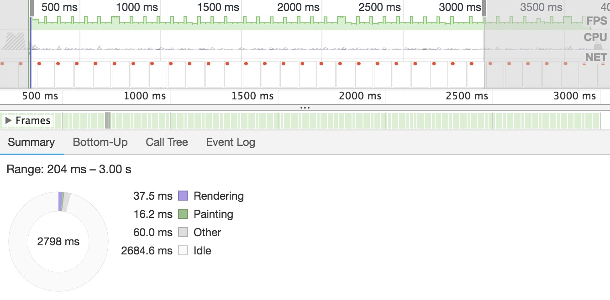
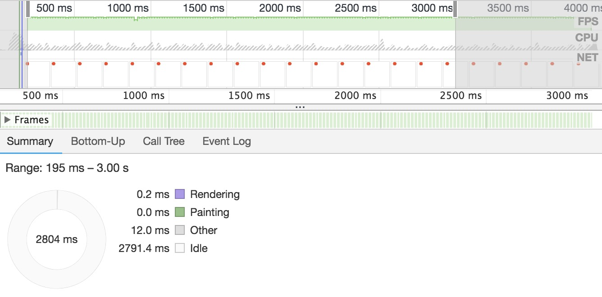
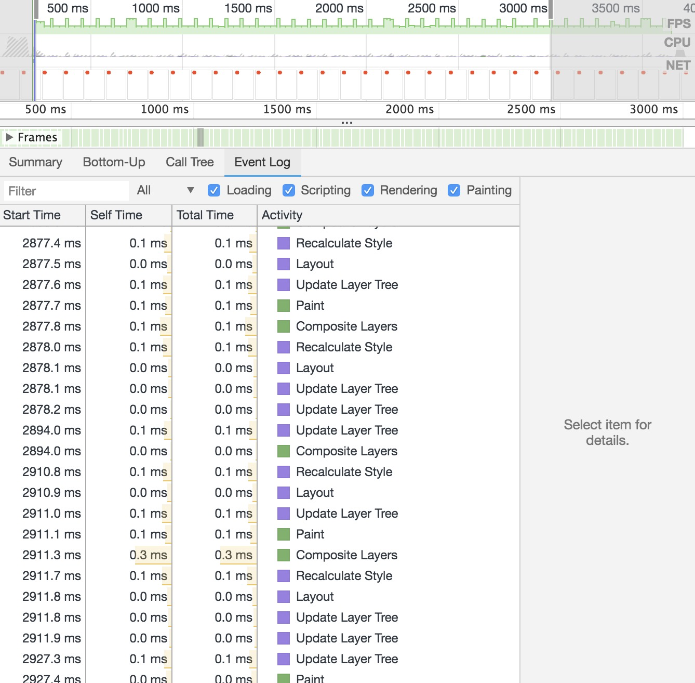
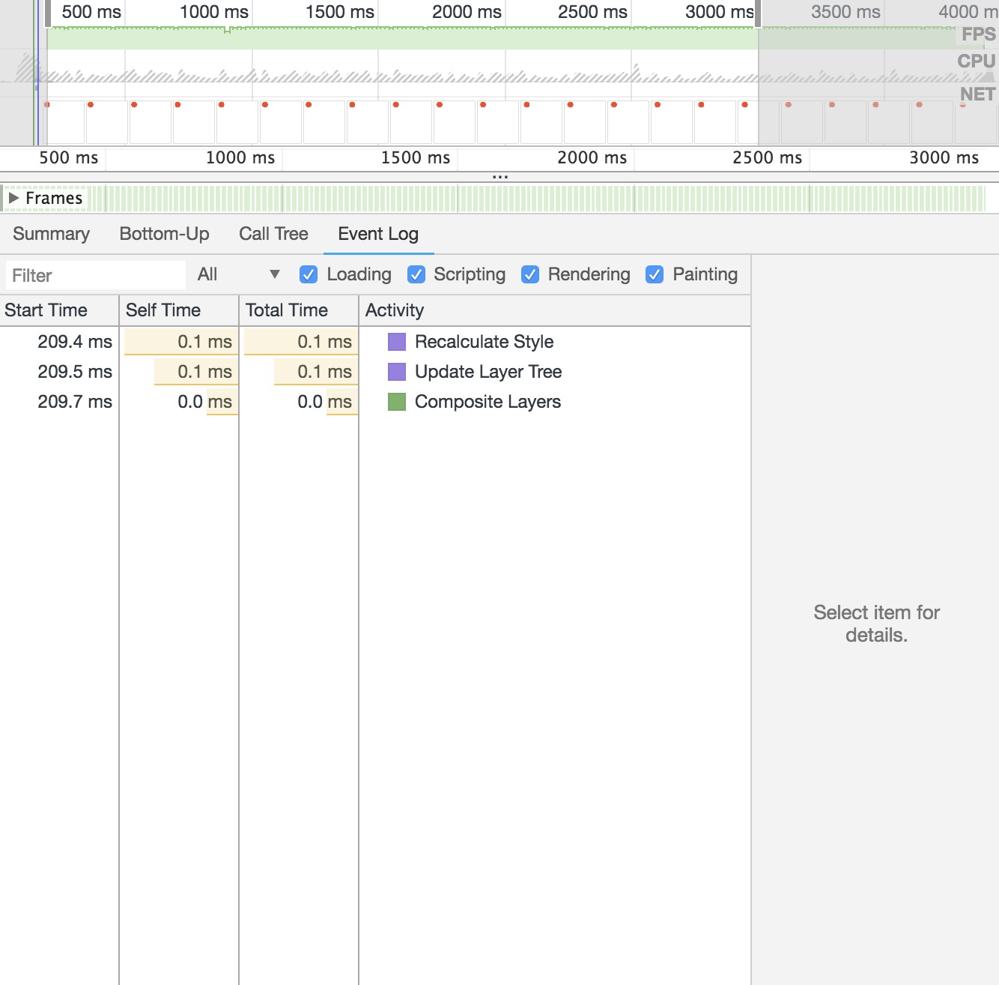

# 位移动画使用 translate 替代其他位移属性

translate 在实现移动时不会发生原始元素重绘，也不会触发其他元素的绘制

因此用在动画中的性能相较 top、left、margin 等更好

## 差异分析

下面通过 chrome 开发者工具中的 performance 功能具体比较了 css3 animation 动画中分别改变 translateX 和 left 时，页面的绘制差异

1. css animation 使用 left 时帧率图以及、事件耗时情况

帧率波动明显，rendering 耗时长

2. css animation 使用 translateX 时的帧率图以及、事件耗时情况

帧率波动平滑，rendering 耗时短

3. css animation 使用 left 时页面事件执行情况，

update layer 在重复执行

4. css animation 使用 translateX 时页面事件执行情况，

update layer 只执行一次

